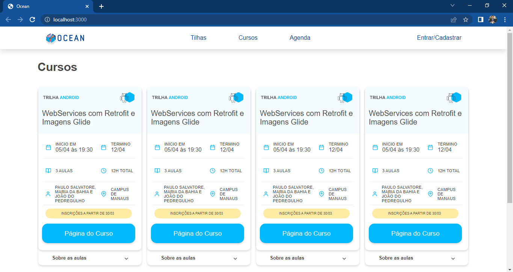
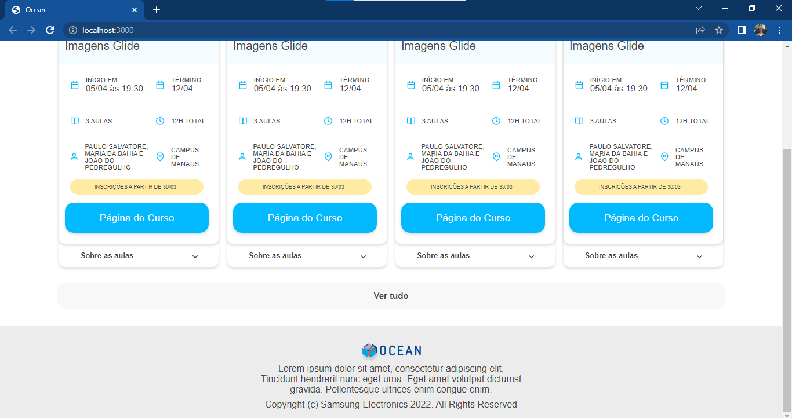
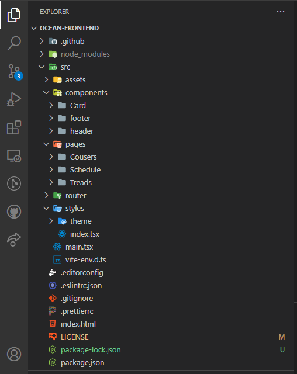

# ocean-frontend

_interface responsiva com ReactJS e TypeScript, usando como referência o wireframe, pronta para receber dados estruturados em um JSON provido por um serviço web._

OCEAN FRONTEND INÍCIO |
:-------------------------:|
|

OCEAN FRONTEND FINAL |
:-------------------------:|
|
## Requirements

  - [x] Estilização fiel ao wireframe;
  - [x] Manipulação do DOM virtual;
  - [x] Implementação de testes unitários e/ou end-to-end;
  - [x] Configuração do projeto – dotfiles.
  - [x] Commits Semântico.

## Instalação da Aplicação

>_Para instalar Ocean-Frontend:_

```
npm install oru yarn install
```

>_Para rodar a aplicação_

```
npm run dev ou yarn run dev
```

>_Para rodar o test e2e_

```
yarn test:e2e
```
## Aquitetura da Aplicação

> O código se encontra componetizado e atendendo ao máximo uma estrutura de projeto completa, mesmo que as features ainda não tenham sido implementadas foram criadas as pastas estruturais do projeto.

OCEAN FRONTEND FINAL |
:-------------------------:|
|


`typescript`: toda a aplicação foi desenvolvida com typescript, com isso podemos fazer a tipagem de variáveis, assim facilitando com que outros devs que vejam o código pela primeira vez o entenda com maior rapidez.

`styled-components`: Toda a perte de theme e estilização da aplicação foi feita com styled componentes, facilitando não so a criação de componentes, como também a tipagem das props do theme.

`axios`: Ficou responsável pelo consumo da “API”.

> OBS: a API fornecida tem todos os campos iguais e sem algum `id` de referencia, que ajudaria a tratar o código melhor. Porém o código foi arquitetado, para que se viesse com funções diferentes modificasse o layout.

`cypress` / `jest`: Os teste foram arquitetado em e2e.

`eslint` / `prettier`: Usado para organização do código no geral.
